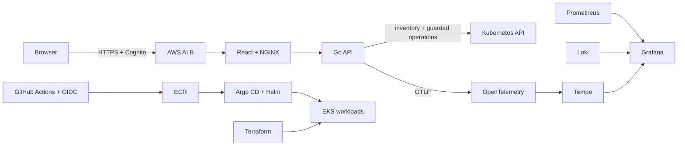

# KubeVista

KubeVista is a Kubernetes operations dashboard backed by a Go API. It is
read-only by default and includes an opt-in, guarded workflow for Deployment
restarts and scaling. I built it to
work through the parts of running EKS that are easy to miss in a small demo:
networking, IAM, GitOps, telemetry, image provenance, failure testing, and
cleanup.

I deployed the full stack to AWS on August 31, 2026, ran the tests documented in
this repository, took it down, and kept the cheaper state and image artifacts.
The public demo uses representative data from that run and clearly labels the
cluster as offline.

## What is in the repository

- Go API using Kubernetes `client-go`, read-only inventory RBAC, and an optional
  namespace-scoped operator role
- React and TypeScript dashboard for workloads, networking, events, incidents,
  security checks, telemetry components, and estimated cost
- Terraform for a three-tier VPC, EKS, IAM, encryption, logging, and budgets
- Helm and Argo CD definitions for the application and platform add-ons
- Prometheus, Grafana, Loki, Tempo, and OpenTelemetry configuration
- GitHub Actions image builds using OIDC, ECR digests, SBOM/provenance
  attestations, scanning, and Cosign signing
- Smoke, access-control, load, disruption, and teardown checks

## Results from the AWS run

| Test | Result |
| --- | --- |
| API load test | `744/744` HTTP 200 at 25 requests/second; `0.842 ms` average and about `4.85 ms` p99 |
| API pod replacement | Replacement Ready in 2 seconds; `896/896` HTTP 200 and about `2.78 ms` p99 |
| Web pod replacement | Replacement Ready in 2 seconds; `896/896` HTTP 200 and about `8.51 ms` p99 |
| Argo CD | 12 applications reported `Synced` and `Healthy` |
| NetworkPolicy | The smoke-test workload connected; an untrusted workload could not reach either application tier |
| Cleanup | Direct AWS API checks found no remaining EKS, VPC, NAT, ALB, Cognito, log, or EBS resources from the environment |

The [test records](docs/evidence/README.md) link each result to the longer run
notes.

## Architecture



Worker nodes, application pods, and observability storage ran in private
subnets across three Availability Zones. The application ALB was public and
used Cognito authentication. Grafana and Argo CD stayed private.

The default API role cannot create, update, delete, exec into pods, or read
Secrets. When guarded operations are explicitly enabled, a separate namespaced
Role allows only Deployment patches and scale-subresource updates. Each request
must pass a server-side dry run, replica guardrails, an optimistic concurrency
check, a five-minute single-use review plan, and an operator-provided reason.
Arbitrary YAML, Secrets, RBAC, exec, and generic deletion remain unavailable.

## Repository layout

| Path | Contents |
| --- | --- |
| `api/` | Go HTTP server and Kubernetes client |
| `web/` | React dashboard and Playwright tests |
| `infra/terraform/` | AWS bootstrap and EKS environment |
| `platform/` | Helm charts and Argo CD applications |
| `docs/` | Design notes, runbooks, and deployment records |

Useful starting points:

- [AWS and Kubernetes stack](docs/platform-stack.md)
- [Deployment guide](docs/deployment.md)
- [Operations and teardown runbook](docs/runbook.md)
- [Container supply chain](docs/supply-chain.md)
- [August 31 deployment record](docs/evidence/live-eks-2026-08-31.md)
- [August 31 teardown record](docs/evidence/teardown-2026-08-31.md)

## Run locally

Prerequisites are pinned in `.tool-versions`: Go 1.26, Node 24, Terraform,
kubectl, and Helm.

```bash
make test
make run-api
make run-web
```

Outside Kubernetes, the API uses the current kubeconfig. Set
`KUBEVISTA_DEMO_MODE=true` to run the API with sample data.

Guarded writes remain off unless `KUBEVISTA_OPERATIONS_ENABLED=true`. Limit
their scope with `KUBEVISTA_OPERATION_NAMESPACES`, `KUBEVISTA_MIN_REPLICAS`,
and `KUBEVISTA_MAX_REPLICAS`. Production mode also requires
`KUBEVISTA_ALB_SIGNER_ARN`; the API verifies the ALB-signed claims token before
using its subject as the operator identity. The Helm chart exposes the same
controls under `operations`; see the runbook before enabling them.

The standalone demo build needs no API or AWS resources:

```bash
cd web
npm run build:demo
```

The root `vercel.json` uses that build and serves `web/dist`.

## Deploy to AWS

Follow [docs/deployment.md](docs/deployment.md). The workflow requires an AWS
IAM Identity Center session and a reviewed Terraform plan. EKS, NAT gateways,
nodes, load balancers, and telemetry storage cost money, so the runbook includes
a controller-aware teardown and post-destroy checks.

Terraform state and the ECR repositories live in a separate bootstrap stack and
can remain after the EKS environment is removed. State files, credentials, and
local variable files are excluded from Git.

## Current status

The dashboard, AWS baseline, GitOps stack, observability stack, public ingress,
image release path, and failure tests have all been exercised on EKS. The live
environment is currently offline. The static demo and retained test records are
the public artifacts.

Ideas I have not implemented yet:

- a Cilium/Hubble profile for network-flow inspection;
- admission-time signature checks with Kyverno;
- longer soak tests and node/AZ disruption scenarios.
