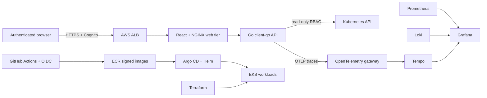

# KubeVista

KubeVista is a production-minded Kubernetes operations dashboard and AWS EKS
reference platform. It is designed as a portfolio project: every component has
a reason to exist, a documented trade-off, and an automated verification path.

## What this demonstrates

- A Go control-plane API using Kubernetes `client-go` and least-privilege RBAC
- A React/TypeScript operations console for workloads, networking, events,
  observability, security posture, and directional cost analysis
- Terraform-managed three-tier VPC and Amazon EKS infrastructure
- GitOps delivery with Argo CD and Helm
- AWS VPC CNI, EBS CSI, EKS Pod Identity, External Secrets, ExternalDNS, and AWS Load Balancer Controller
- Prometheus, Grafana, Loki, Tempo, and OpenTelemetry metrics, logs, and traces
- CI checks, autoscaling, disruption budgets, probes, and graceful shutdown
- Immutable ECR images with SBOM/provenance attestations and keyless Cosign signatures

## Verified outcomes

These are measurements from the recorded live deployment, not projected claims:

| Validation | Result |
| --- | --- |
| Baseline API load | `744/744` HTTP 200 at 25 requests/second; `0.842 ms` average, ~`4.85 ms` p99 |
| API pod replacement | Ready in 2 seconds; `896/896` HTTP 200 during disruption, ~`2.78 ms` p99 |
| Web pod replacement | Ready in 2 seconds; `896/896` HTTP 200 during disruption, ~`8.51 ms` p99 |
| GitOps convergence | 12 Argo CD applications `Synced` and `Healthy` |
| Network isolation | Authorized smoke workload succeeded; untrusted workload was blocked from both tiers |
| Teardown | EKS, VPC, NAT, ALB, Route53 delegation, Cognito, KMS, logs, and storage verified absent |

See the [evidence index](docs/evidence/README.md) for the claim-to-proof map.

## Architecture



The EKS nodes, observability storage, and application workloads run in private
subnets across Availability Zones. Only the authenticated ALB is public;
Grafana and Argo CD remain private administrative surfaces.

The dashboard is intentionally **read-only by default**. Mutating cluster tools
look impressive in demos but create an unnecessarily dangerous security model.

## Repository layout

| Path | Purpose |
| --- | --- |
| `api/` | Go API and Kubernetes adapter |
| `web/` | React/TypeScript UI |
| `infra/terraform/` | AWS network, EKS, IAM, and add-ons |
| `platform/` | Argo CD and Helm definitions |
| `docs/` | Architecture decisions, runbooks, and threat model |

The complete eight-layer inventory is in
[docs/platform-stack.md](docs/platform-stack.md), and operational commands are
in [docs/runbook.md](docs/runbook.md). Upstream design sources are collected in
[docs/references.md](docs/references.md).

The frontend deliberately avoids a generic component-library look. Its visual
and data-integrity rules are documented in [docs/frontend.md](docs/frontend.md),
and the container trust path is documented in
[docs/supply-chain.md](docs/supply-chain.md).
Authenticated HTTPS delivery and delegated DNS are documented in
[docs/public-delivery.md](docs/public-delivery.md).

## Local development

Prerequisites: Go 1.26+, Node 24+, Docker, kubectl, Helm, and optionally kind.

```bash
make test
make run-api
make run-web
```

The API uses your current kubeconfig outside a cluster and in-cluster service
account credentials on EKS. Set `KUBEVISTA_DEMO_MODE=true` to run without a
cluster while developing the UI.

To build the permanent, zero-AWS-cost recruiter demo, run:

```bash
cd web
npm run build:demo
```

That build embeds an explicitly labeled snapshot from the validated EKS run;
it never presents sample data as a currently running cluster. The root
`vercel.json` configures this profile for static hosting.

## AWS deployment

Start with [docs/deployment.md](docs/deployment.md). A continuously running EKS
environment costs real money; use the documented teardown workflow when the
demo is not needed. Never commit Terraform state or AWS credentials. The first
end-to-end deployment is recorded in
[docs/evidence/live-eks-2026-08-31.md](docs/evidence/live-eks-2026-08-31.md),
and its verified destruction and retained artifacts are recorded in
[docs/evidence/teardown-2026-08-31.md](docs/evidence/teardown-2026-08-31.md).

## Roadmap

- [x] Repository architecture and production guardrails
- [x] Go health/readiness API and container image
- [x] Live Kubernetes node, namespace, and pod inventory API
- [x] Helm workload with RBAC, PDB, autoscaling, and network policy
- [x] Terraform VPC/EKS baseline, encrypted remote-state bootstrap, and cost budget
- [x] Pod Identity-backed AWS integrations and encrypted EBS storage
- [x] GitOps definitions for Prometheus, Grafana, Loki, Tempo, and OpenTelemetry
- [x] Kubernetes workload, event, network, observability, security, and cost APIs
- [x] Live multi-view operations console with filtering and responsive navigation
- [x] Workload drill-down with Pods, images, Services, NetworkPolicies, and Events
- [x] Correlated incident timelines and server-sent cluster update stream
- [x] GitOps platform add-on bootstrap definitions
- [x] Deployable web tier and signed ECR image supply chain
- [ ] Cilium/Hubble advanced networking profile
- [ ] Kyverno signature enforcement and runtime security profile
- [x] Load, failure, recovery, and security evidence in `docs/evidence/`
- [x] Cognito-authenticated HTTPS ingress and GitOps-managed Route53 DNS

See [docs/architecture.md](docs/architecture.md) for scope and engineering decisions.
