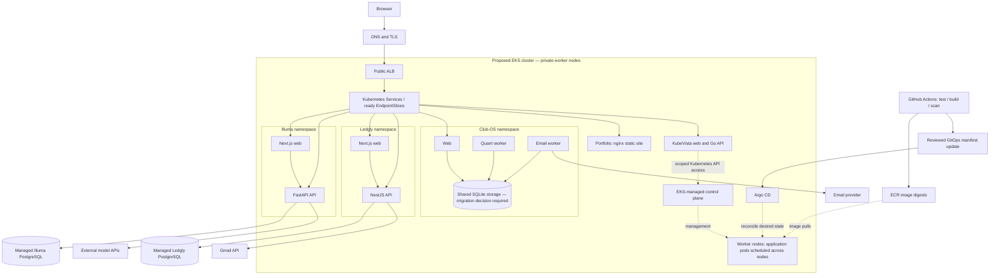
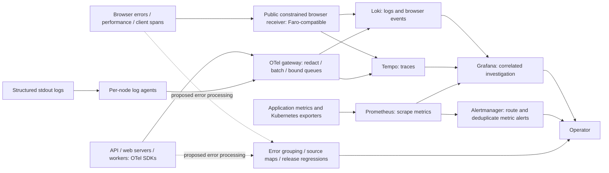

# Multi-app station: proposed EKS deployment

This is a design, not a deployment record. Illuma, Ledgly, Club-OS, and the portfolio have not been migrated by this change. Replica counts, routes, health, and traffic in a future preview must be marked as simulated. Keep the existing historical EKS test evidence separate.

## Request and deployment paths

These are logical relationships, not physical packet hops. DNS resolves the entrypoint; it does not proxy requests. Exact browser-versus-server API calls, hostnames, external dependencies, and policies must be checked against each app before implementation. The diagram does not imply cross-app calls.

Club-OS currently shares a SQLite file between processes. Do not illustrate arbitrary multi-node replicas as safe: choose deliberate single-node scheduling/storage with its availability limits, or migrate the persistence layer first. Managed PostgreSQL stays outside the worker rooms. Hosting the portfolio in EKS is an intentional platform exercise; static object storage remains a simpler alternative.

## Observability and error investigation

Receiver and exporter compatibility must be validated when selecting versions. This is not an assertion that a generic OTel receiver accepts Faro's wire format. Source-map resolution and issue tracking are separate capabilities; OSS Faro plus Loki does not automatically reproduce Grafana Cloud Frontend Observability or Sentry.

### Upgrade order

1. **Correlated application signals.** Structured JSON logs with service, environment, release SHA, severity, trace ID, span ID, route template, and bounded error metadata. Propagate trace context through HTTP and supported job boundaries. Do not put trace IDs, user IDs, or full URLs in Prometheus labels.
2. **Browser coverage.** Capture unhandled errors, rejected promises, navigation/performance signals, and selected breadcrumbs. Use an explicitly exposed browser ingestion endpoint with payload limits, abuse controls, and privacy filtering. Never expose the unrestricted internal collector. CORS is not authentication; never embed a private ingestion secret in frontend code.
3. **Readable errors and releases.** Upload private source maps from CI keyed to immutable release and bundle identifiers. Resolve stack traces, fingerprint repeated errors, track first/last seen and occurrences, and detect regressions after a release. Do not publish source maps unintentionally with static assets.
4. **Incident workflow.** Add assignment, acknowledge/resolve/reopen states, release annotations, runbook links, and alerts based on user impact. Define a service-specific availability/latency objective before choosing burn-rate thresholds. Session replay is a separate, privacy-sensitive feature and is out of initial scope.
5. **Reliable telemetry storage.** Define retention and volume budgets; persist data, monitor ingestion failures and dropped records, bound buffering, and test backend outages. Sample routine traces deliberately while retaining useful error evidence within capacity. Metrics must remain useful even when traces are sampled.
6. **Replacement trial.** Run alongside Sentry. Inject browser and server exceptions and verify readable source locations, correct grouping, release association, log/trace correlation, and alert delivery. Verify secrets and personal data are absent. Remove Sentry only after the capabilities actually needed by the apps pass these checks.

Avoid collecting admission essays, financial records, email bodies, credentials, session cookies, or request bodies by default. Filter at instrumentation and collection boundaries. Redaction is defense in depth, not a promise that arbitrary logs are safe.

## Station visual design

Retain the existing navy floor, blue-grey walls, cream robots, namespace accents, and current typography. No new dashboard-card layer or bottom action bar.

- Worker rooms remain nodes, not one room per app. Spread eligible app robots across nodes; namespace colors and short hover nametags identify the applications.
- An Internet globe sits outside the cluster perimeter. The ingress booth routes to Service desks and then to the represented endpoint pods. Selecting an app emphasizes only its proposed route.
- Database cabinets sit outside the cluster boundary, with separate ownership labels on inspection. Club-OS's storage locker stays attached to its constrained workload until its persistence design changes.
- A telemetry workshop contains a log archive (Loki), trace sorter (Tempo), metrics instruments (Prometheus), and shared viewing console (Grafana). Per-node agents are small maintenance robots in each worker room.
- A proposed error-triage desk represents grouping, stack traces, and release history. Its inspector says 'planned', not 'healthy', until implemented.
- Application routes use cyan, telemetry lavender, management amber, and delivery green. Distinguish routes with dash patterns and inspection text as well as color. Keep floor-aligned routing and reduce unrelated edges on selection.
- Traffic pulses in demo mode are illustrative, not measured requests. Keep one persistent 'Simulated EKS deployment' label. Do not invent throughput, latency, users affected, or policy enforcement results.
- Maintain open floor space, keyboard-accessible object inspection, reduced-motion behavior, and the existing pan/zoom interaction. Prefer hover detail to permanent paragraphs.

## Local prototype status

Open the demo build with `?fleet=1#/station` to inspect the proposed fleet. The original scenario remains available without `fleet=1`. View & lab → Simulation lab contains a link between scenarios.

Implemented locally:

- Proposed app Deployments, four worker nodes, four OTel agent replicas, synthetic Service endpoints and Ingress paths using reserved `.example.test` names.
- External dependency objects, proposed connection lines, and a clickable error-triage desk. Example grouping is service/type/normalized-frame based and resets on reload. A separate opt-in [local error service](local-error-service.md) persists browser error categories, supports version-checked resolution, and reopens recurring issues. It is disabled in production.
- Club-OS placement is pinned to one simulated node, with explicit SQLite availability limitations.
- Go HTTP request logs include route templates, service version, environment, status, duration, and trace/span IDs when present. Production server logging uses JSON. The request logger excludes headers, bodies, query strings, and raw paths; this does not audit or sanitize every existing application log call.

Not implemented: live app migrations, browser error ingestion, persistent issue storage, source-map uploads/symbolication, alert delivery, owner assignment, session replay, and an end-to-end comparison with Sentry. Existing observability manifests were not deployed or changed by this prototype. The broader replacement plan above remains work to do.

Checks: `npm --prefix web run build:demo`, `node --test web/tests/error-triage.unit.ts`, and Go HTTP API tests passed. Browser verification confirmed fleet workloads, dependency objects, and the inject → group → resolve → regress interaction. Full responsive visual QA remains outstanding.

## Sources

- [Faro OSS](https://grafana.com/oss/faro/)
- [Grafana Cloud Frontend Observability](https://grafana.com/docs/grafana-cloud/observe-and-act/monitor-applications/frontend-observability/)
- [Source map uploads](https://grafana.com/docs/grafana-cloud/observe-and-act/monitor-applications/frontend-observability/configure/sourcemap-uploads/cli/)
- [OpenTelemetry sensitive-data handling](https://opentelemetry.io/docs/security/handling-sensitive-data/)
